# 🛍️ ShopNow — Microservices eCommerce Platform

> A full-stack eCommerce system built with **Java 21 · Spring Boot 4.x · Next.js 14**,
> designed as a portfolio project demonstrating real-world microservices architecture.

---

## 📌 Table of Contents

- [Overview](#-overview)
- [Architecture](#-architecture)
- [Services](#-services)
- [Tech Stack](#-tech-stack)
- [Infrastructure](#-infrastructure)
- [Core Workflows](#-core-workflows)
  - [Purchase Flow](#1-purchase-flow-end-to-end)
  - [Authentication Flow](#2-authentication--gateway-flow)
  - [File Upload Flow](#3-file-upload-flow)
- [Project Structure](#-project-structure)
- [Getting Started](#-getting-started)

---

## 🧭 Overview

ShopNow is a microservices-based eCommerce platform that covers the full shopping lifecycle — from user registration and product browsing, to cart management, order placement, payment processing, and real-time customer support chat.

**Key design goals:**
- Each service owns its own database (no shared DB)
- All client requests route through a single API Gateway
- Synchronous HTTP for most inter-service calls; Kafka for async events
- Redis for caching and token blacklisting
- AWS S3 for file storage

---

## 🏛 Architecture

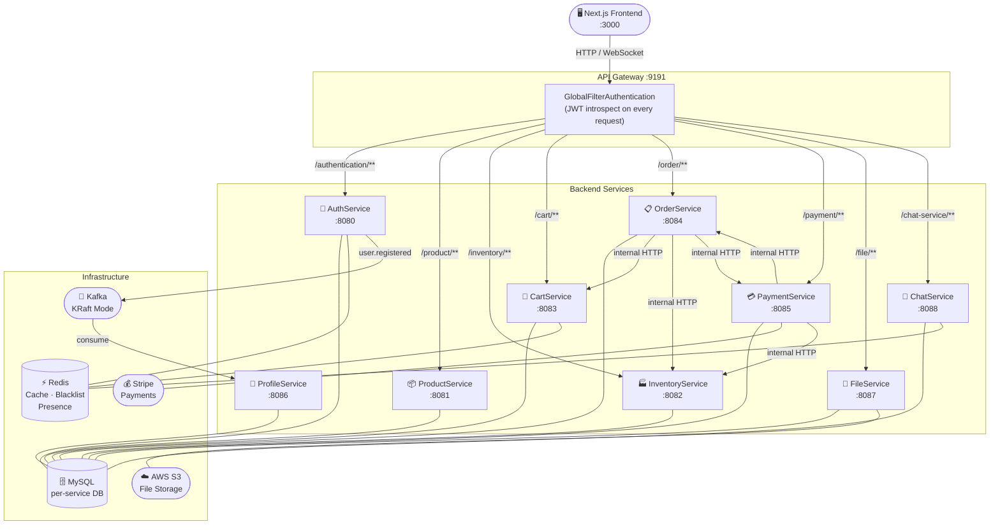
```mermaid
graph TD
    Client(["🖥️ Next.js Frontend\n:3000"])

    Client -->|HTTP / WebSocket| GW

    subgraph Gateway ["API Gateway :9191"]
        GW["GlobalFilterAuthentication\n(JWT introspect on every request)"]
    end

    GW -->|"/authentication/**"| Auth
    GW -->|"/product/**"| Product
    GW -->|"/inventory/**"| Inventory
    GW -->|"/cart/**"| Cart
    GW -->|"/order/**"| Order
    GW -->|"/payment/**"| Payment
    GW -->|"/file/**"| File
    GW -->|"/chat-service/**"| Chat

    subgraph Services ["Backend Services"]
        Auth["🔐 AuthService\n:8080"]
        Product["📦 ProductService\n:8081"]
        Inventory["🏭 InventoryService\n:8082"]
        Cart["🛒 CartService\n:8083"]
        Order["📋 OrderService\n:8084"]
        Payment["💳 PaymentService\n:8085"]
        Profile["👤 ProfileService\n:8086"]
        File["📁 FileService\n:8087"]
        Chat["💬 ChatService\n:8088"]
    end

    subgraph Infra ["Infrastructure"]
        MySQL[("🗄️ MySQL\nper-service DB")]
        Redis[("⚡ Redis\nCache · Blacklist\nPresence")]
        Kafka(["📨 Kafka\nKRaft Mode"])
        S3(["☁️ AWS S3\nFile Storage"])
        Stripe(["💰 Stripe\nPayments"])
    end

    Auth --- MySQL
    Auth --- Redis
    Product --- MySQL
    Inventory --- MySQL
    Cart --- MySQL
    Cart --- Redis
    Order --- MySQL
    Payment --- MySQL
    Payment --- Stripe
    Profile --- MySQL
    File --- MySQL
    File --- S3
    Chat --- MySQL
    Chat --- Redis

    Auth -->|"user.registered"| Kafka
    Kafka -->|consume| Profile

    Order -->|internal HTTP| Cart
    Order -->|internal HTTP| Inventory
    Order -->|internal HTTP| Payment
    Payment -->|internal HTTP| Order
    Payment -->|internal HTTP| Inventory
```

---

## 🗂 Services

| Service | Port | Responsibility |
|---------|------|----------------|
| **API Gateway** | `9191` | Single entry point, JWT validation, routing, CORS |
| **AuthService** | `8080` | Register, Login, Logout, JWT issue & introspect, token blacklist |
| **ProductService** | `8081` | Product catalog, categories, variants, Redis caching |
| **InventoryService** | `8082` | Stock tracking, reserve/release/deduct, optimistic lock |
| **CartService** | `8083` | Shopping cart CRUD, Redis cache (TTL 20 min) |
| **OrderService** | `8084` | Order lifecycle, checkout, auto-cancel stale orders |
| **PaymentService** | `8085` | Stripe PaymentIntent, webhook handling, idempotency |
| **ProfileService** | `8086` | User profile, consumes `user.registered` Kafka event |
| **FileService** | `8087` | Multi-file upload to AWS S3, temp file cleanup (2 AM daily) |
| **ChatService** | `8088` | Real-time chat (STOMP/WebSocket), support routing, online presence |

---

## 🛠 Tech Stack

### Backend
| Category | Technology |
|----------|-----------|
| Language | Java 21 |
| Framework | Spring Boot 4.x |
| Security | Spring Security, JWT (Nimbus JOSE) |
| ORM | Spring Data JPA / Hibernate |
| Messaging | Apache Kafka (KRaft — no Zookeeper) |
| Cache | Redis 7 (AOF persistence) |
| Real-time | Spring WebSocket + STOMP |
| HTTP Client | Spring 6 HTTP Interface |
| API Docs | Swagger UI (per service) |
| Payments | Stripe SDK |
| Storage | AWS S3 |

### Frontend
| Category | Technology |
|----------|-----------|
| Framework | Next.js 14 (App Router) |
| Language | TypeScript |
| State | Zustand |
| HTTP | Axios |
| WebSocket | STOMP.js |
| Payments | Stripe Elements |

### Infrastructure
| Component | Technology |
|-----------|-----------|
| Container | Docker Compose |
| Network | `shopnow-network` (bridge) |
| Database | MySQL 8 (one DB per service) |
| Cache | Redis 7 Alpine |
| Messaging | Confluent Kafka (KRaft) |
| Kafka UI | Provectus Kafka UI `:8090` |

---

## ⚙️ Infrastructure

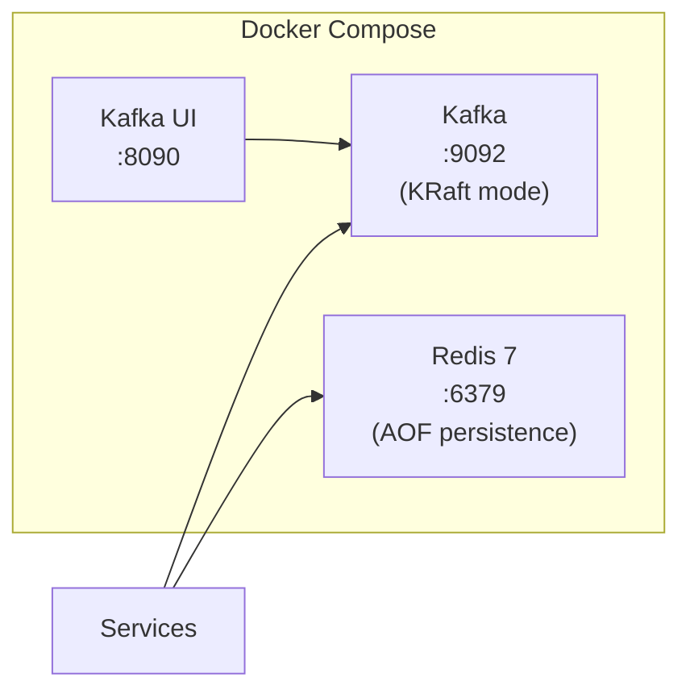
```mermaid
graph LR
    subgraph Docker Compose
        Kafka["Kafka\n:9092\n(KRaft mode)"]
        KafkaUI["Kafka UI\n:8090"]
        Redis["Redis 7\n:6379\n(AOF persistence)"]
    end

    KafkaUI --> Kafka
    Services --> Kafka
    Services --> Redis
```

**Redis** serves multiple roles across services:

| Service | Redis Usage |
|---------|------------|
| AuthService | Token blacklist (jwtId → TTL auto-expire) |
| CartService | Cart cache (TTL 20 min, `@Cacheable`) |
| ChatService | Online presence (`last_seen:{userId}`), typing indicator, socket sessions |

---

## 🔄 Core Workflows

### 1. Purchase Flow (End-to-End)

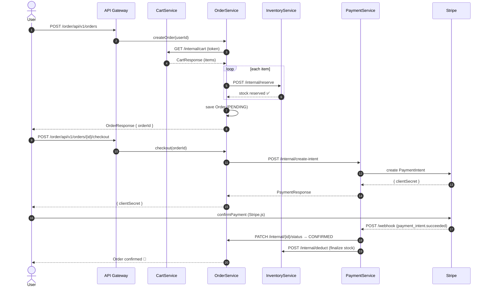
```mermaid
sequenceDiagram
    autonumber
    actor User
    participant GW as API Gateway
    participant Cart as CartService
    participant Order as OrderService
    participant Inventory as InventoryService
    participant Payment as PaymentService
    participant Stripe as Stripe

    User->>GW: POST /order/api/v1/orders
    GW->>Order: createOrder(userId)

    Order->>Cart: GET /internal/cart (token)
    Cart-->>Order: CartResponse (items)

    loop each item
        Order->>Inventory: POST /internal/reserve
        Inventory-->>Order: stock reserved ✅
    end

    Order->>Order: save Order (PENDING)
    Order-->>User: OrderResponse { orderId }

    User->>GW: POST /order/api/v1/orders/{id}/checkout
    GW->>Order: checkout(orderId)

    Order->>Payment: POST /internal/create-intent
    Payment->>Stripe: create PaymentIntent
    Stripe-->>Payment: { clientSecret }
    Payment-->>Order: PaymentResponse
    Order-->>User: { clientSecret }

    User->>Stripe: confirmPayment (Stripe.js)
    Stripe-->>Payment: POST /webhook (payment_intent.succeeded)

    Payment->>Order: PATCH /internal/{id}/status → CONFIRMED
    Payment->>Inventory: POST /internal/deduct (finalize stock)

    Order-->>User: Order confirmed 🎉
```

---

### 2. Authentication & Gateway Flow

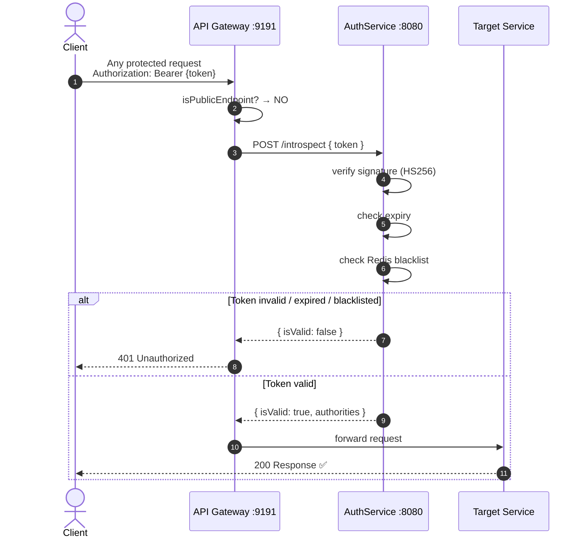
```mermaid
sequenceDiagram
    autonumber
    actor Client
    participant GW as API Gateway :9191
    participant Auth as AuthService :8080
    participant Target as Target Service

    Client->>GW: Any protected request<br/>Authorization: Bearer {token}

    GW->>GW: isPublicEndpoint? → NO

    GW->>Auth: POST /introspect { token }
    Auth->>Auth: verify signature (HS256)
    Auth->>Auth: check expiry
    Auth->>Auth: check Redis blacklist

    alt Token invalid / expired / blacklisted
        Auth-->>GW: { isValid: false }
        GW-->>Client: 401 Unauthorized
    else Token valid
        Auth-->>GW: { isValid: true, authorities }
        GW->>Target: forward request
        Target-->>Client: 200 Response ✅
    end
```

---

### 3. File Upload Flow

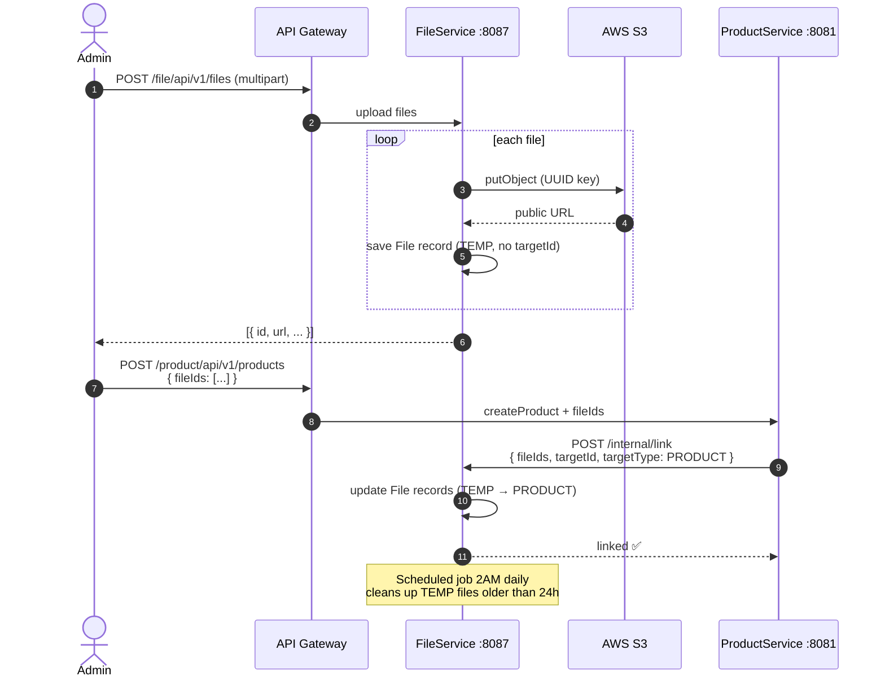
```mermaid
sequenceDiagram
    autonumber
    actor Admin
    participant GW as API Gateway
    participant File as FileService :8087
    participant S3 as AWS S3
    participant Product as ProductService :8081

    Admin->>GW: POST /file/api/v1/files (multipart)
    GW->>File: upload files

    loop each file
        File->>S3: putObject (UUID key)
        S3-->>File: public URL
        File->>File: save File record (TEMP, no targetId)
    end

    File-->>Admin: [{ id, url, ... }]

    Admin->>GW: POST /product/api/v1/products<br/>{ fileIds: [...] }
    GW->>Product: createProduct + fileIds

    Product->>File: POST /internal/link<br/>{ fileIds, targetId, targetType: PRODUCT }
    File->>File: update File records (TEMP → PRODUCT)
    File-->>Product: linked ✅

    Note over File: Scheduled job 2AM daily<br/>cleans up TEMP files older than 24h
```

---

## 📁 Project Structure

```
ShopNow/
├── backend/
│   ├── ApiGatewayService/      # :9191 — routing + JWT filter
│   ├── AuthenticationService/  # :8080 — auth, JWT, Redis blacklist
│   ├── productService/         # :8081 — catalog, categories
│   ├── InventoryService/       # :8082 — stock, reserve/deduct
│   ├── CartService/            # :8083 — cart + Redis cache
│   ├── OrderService/           # :8084 — order lifecycle
│   ├── PaymentService/         # :8085 — Stripe integration
│   ├── ProfileService/         # :8086 — user profile
│   ├── FileService/            # :8087 — S3 upload
│   ├── ChatService/            # :8088 — WebSocket chat
│   └── docker-compose.yml      # Kafka + Redis
│
└── frontend/
    └── shopnow-frontend/       # Next.js 14
        ├── src/
        │   ├── app/            # App Router pages
        │   ├── services/       # Axios API clients
        │   ├── stores/         # Zustand state
        │   └── types/          # TypeScript types
        └── .env.local          # API URLs → all via :9191
```

---

## 🚀 Getting Started

### Prerequisites

- Java 21
- Node.js 18+
- Docker & Docker Compose
- AWS Account (S3)
- Stripe Account

### 1. Start Infrastructure

```bash
cd backend
docker compose up -d
```

Starts: **Kafka** `:9092`, **Kafka UI** `:8090`, **Redis** `:6379`

### 2. Start Backend Services

Start each service in order (Auth → Product → Inventory → Cart → Order → Payment → Profile → File → Chat → Gateway):

```bash
# Example — run from each service directory
./mvnw spring-boot:run
```

Or open in IntelliJ and run all services via the Spring Boot run configurations.

### 3. Start Frontend

```bash
cd frontend/shopnow-frontend
npm install
npm run dev
```

App available at `http://localhost:3000`

### 4. Environment Variables

Each backend service has its own `application.yml`. Key configs:

```yaml
# Common pattern
jwt:
  secret-key: <base64-encoded-secret>

internal:
  api-key: <shared-internal-key>

spring:
  datasource:
    url: jdbc:mysql://localhost:3306/ecommerce_<service>
  kafka:
    bootstrap-servers: localhost:9092
  data:
    redis:
      host: localhost
      port: 6379
```

Frontend `.env.local`:
```env
NEXT_PUBLIC_AUTH_SERVICE_URL=http://localhost:9191/authentication
NEXT_PUBLIC_PRODUCT_SERVICE_URL=http://localhost:9191/product
NEXT_PUBLIC_CART_SERVICE_URL=http://localhost:9191/cart
NEXT_PUBLIC_ORDER_SERVICE_URL=http://localhost:9191/order
NEXT_PUBLIC_PAYMENT_SERVICE_URL=http://localhost:9191/payment
NEXT_PUBLIC_PROFILE_SERVICE_URL=http://localhost:9191/profile
NEXT_PUBLIC_FILE_SERVICE_URL=http://localhost:9191/file
NEXT_PUBLIC_CHAT_SERVICE_URL=http://localhost:9191/chat-service
NEXT_PUBLIC_STRIPE_PUBLISHABLE_KEY=pk_test_...
```

---

## 🔐 Security Design

```
Public endpoints (no JWT required):
  POST /authentication/api/v1/auth/login
  POST /authentication/api/v1/users/register
  POST /payment/api/payment/webhook      ← Stripe webhook
  WS   /chat-service/ws/**

Protected endpoints:
  All others → API Gateway validates JWT via introspect

Internal endpoints (service-to-service):
  /*/internal/** → blocked at Gateway for external callers
                 → requires X-Internal-Key header
```

---

*Built by a Junior Java Developer as a portfolio project · Java 21 · Spring Boot 4.x · Next.js 14*

# 🔐 Authentication Service

> **ShopNow Microservices** · Spring Boot · Java 21 · Port `8080`

Dịch vụ xác thực trung tâm của hệ thống ShopNow. Chịu trách nhiệm đăng ký tài khoản, đăng nhập, phát hành JWT, thu hồi token (blacklist) và xác thực token cho toàn bộ hệ thống.

---

## 📋 Table of Contents

- [Tech Stack](#-tech-stack)
- [Architecture Overview](#-architecture-overview)
- [Database Schema](#-database-schema)
- [API Endpoints](#-api-endpoints)
- [Workflow Diagrams](#-workflow-diagrams)
  - [1. Register (Đăng ký)](#1-register-flow)
  - [2. Login (Đăng nhập)](#2-login-flow)
  - [3. Logout (Đăng xuất)](#3-logout-flow)
  - [4. Token Introspect (Xác thực token)](#4-introspect-flow)
  - [5. Protected Request (Gọi API có bảo vệ)](#5-protected-request-flow)
- [JWT Token Structure](#-jwt-token-structure)
- [Token Blacklist Strategy](#-token-blacklist-strategy)

---

## 🛠 Tech Stack

| Component | Technology |
|-----------|-----------|
| Framework | Spring Boot 4.x, Spring Security |
| Language | Java 21 |
| Database | MySQL (users, roles, user_has_role) |
| Cache / Blacklist | Redis (AOF persistence) |
| JWT Library | Nimbus JOSE + JWT |
| Messaging | Apache Kafka (KRaft mode) |
| API Docs | Swagger UI (`/swagger-ui.html`) |

---

## 🏛 Architecture Overview

```
┌────────────────────────────────────────────────────┐
│                   API Gateway :9191                 │
│          GlobalFilterAuthentication                 │
│   (intercepts every request, calls /introspect)    │
└────────────────────┬───────────────────────────────┘
                     │
          ┌──────────▼──────────┐
          │  AuthService :8080  │
          │  ┌───────────────┐  │
          │  │  AuthService  │  │  ← login / logout / introspect
          │  │  UserService  │  │  ← register / assignRole
          │  │  JwtService   │  │  ← generate / verify token
          │  └───────┬───────┘  │
          └──────────┼──────────┘
                     │
          ┌──────────┼──────────────────┐
          │          │                  │
    ┌─────▼───┐  ┌───▼────┐   ┌────────▼──────┐
    │  MySQL  │  │ Redis  │   │ Kafka Producer │
    │  users  │  │ token  │   │ user.registered│
    │  roles  │  │blacklst│   └───────────────┘
    └─────────┘  └────────┘
```

---

## 🗄 Database Schema

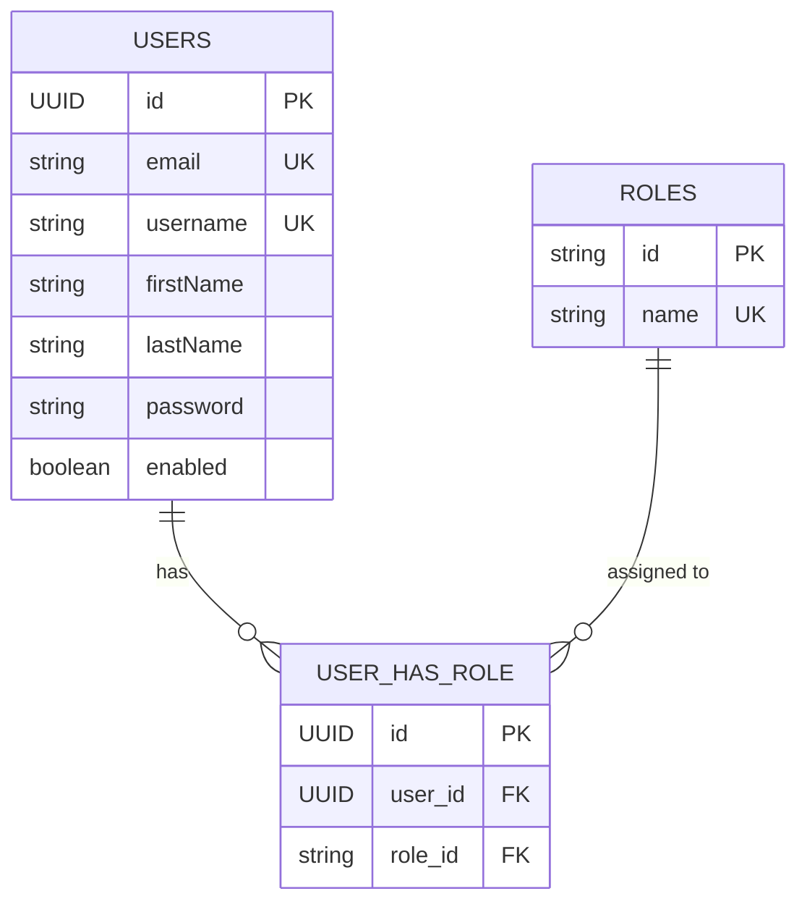
```mermaid
erDiagram
    USERS {
        UUID id PK
        string email UK
        string username UK
        string firstName
        string lastName
        string password
        boolean enabled
    }

    ROLES {
        string id PK
        string name UK
    }

    USER_HAS_ROLE {
        UUID id PK
        UUID user_id FK
        string role_id FK
    }

    USERS ||--o{ USER_HAS_ROLE : "has"
    ROLES ||--o{ USER_HAS_ROLE : "assigned to"
```

> **Redis** lưu token bị thu hồi dưới dạng:
> ```
> Key:   token:{jwtId}
> Value: (jwtId, expiredTime)
> TTL:   remainingTime của token (auto-expire khi token hết hạn)
> ```

---

## 📡 API Endpoints

| Method | Path | Auth | Description |
|--------|------|------|-------------|
| `POST` | `/api/v1/users/register` | ❌ Public | Đăng ký tài khoản mới |
| `POST` | `/api/v1/auth/login` | ❌ Public | Đăng nhập, nhận JWT |
| `POST` | `/api/v1/auth/logout` | ✅ Bearer | Thu hồi access token |
| `POST` | `/api/v1/auth/introspect` | ❌ Internal | Xác thực token (gọi bởi Gateway) |
| `POST` | `/api/v1/users/{userId}/roles` | ✅ Bearer | Gán role cho user |

---

## 📊 Workflow Diagrams

### 1. Register Flow

Đăng ký tài khoản mới → lưu DB → publish Kafka event để ProfileService tạo profile.

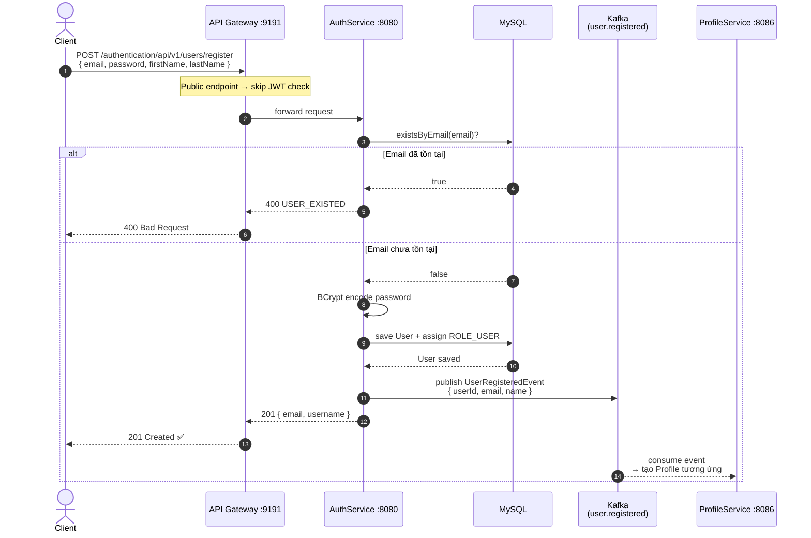
```mermaid
sequenceDiagram
    autonumber
    actor Client
    participant Gateway as API Gateway :9191
    participant Auth as AuthService :8080
    participant MySQL as MySQL
    participant Kafka as Kafka<br/>(user.registered)
    participant Profile as ProfileService :8086

    Client->>Gateway: POST /authentication/api/v1/users/register<br/>{ email, password, firstName, lastName }
    Note over Gateway: Public endpoint → skip JWT check
    Gateway->>Auth: forward request

    Auth->>MySQL: existsByEmail(email)?
    alt Email đã tồn tại
        MySQL-->>Auth: true
        Auth-->>Gateway: 400 USER_EXISTED
        Gateway-->>Client: 400 Bad Request
    else Email chưa tồn tại
        MySQL-->>Auth: false
        Auth->>Auth: BCrypt encode password
        Auth->>MySQL: save User + assign ROLE_USER
        MySQL-->>Auth: User saved

        Auth->>Kafka: publish UserRegisteredEvent<br/>{ userId, email, name }
        Auth-->>Gateway: 201 { email, username }
        Gateway-->>Client: 201 Created ✅

        Kafka-->>Profile: consume event<br/>→ tạo Profile tương ứng
    end
```

---

### 2. Login Flow

Xác thực credentials → phát hành Access Token (30 phút) + Refresh Token (60 phút).

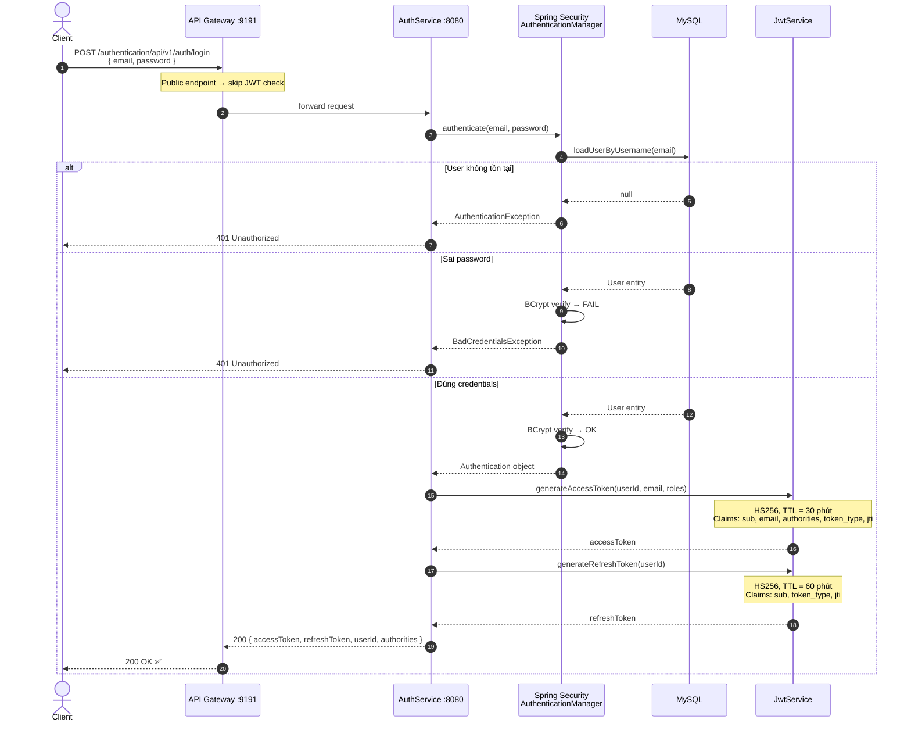
```mermaid
sequenceDiagram
    autonumber
    actor Client
    participant Gateway as API Gateway :9191
    participant Auth as AuthService :8080
    participant Security as Spring Security<br/>AuthenticationManager
    participant MySQL as MySQL
    participant JWT as JwtService

    Client->>Gateway: POST /authentication/api/v1/auth/login<br/>{ email, password }
    Note over Gateway: Public endpoint → skip JWT check
    Gateway->>Auth: forward request

    Auth->>Security: authenticate(email, password)
    Security->>MySQL: loadUserByUsername(email)

    alt User không tồn tại
        MySQL-->>Security: null
        Security-->>Auth: AuthenticationException
        Auth-->>Client: 401 Unauthorized
    else Sai password
        MySQL-->>Security: User entity
        Security->>Security: BCrypt verify → FAIL
        Security-->>Auth: BadCredentialsException
        Auth-->>Client: 401 Unauthorized
    else Đúng credentials
        MySQL-->>Security: User entity
        Security->>Security: BCrypt verify → OK
        Security-->>Auth: Authentication object

        Auth->>JWT: generateAccessToken(userId, email, roles)
        Note over JWT: HS256, TTL = 30 phút<br/>Claims: sub, email, authorities, token_type, jti
        JWT-->>Auth: accessToken

        Auth->>JWT: generateRefreshToken(userId)
        Note over JWT: HS256, TTL = 60 phút<br/>Claims: sub, token_type, jti
        JWT-->>Auth: refreshToken

        Auth-->>Gateway: 200 { accessToken, refreshToken, userId, authorities }
        Gateway-->>Client: 200 OK ✅
    end
```

---

### 3. Logout Flow

Thu hồi token bằng cách lưu `jwtId` vào Redis Blacklist với TTL = thời gian còn lại của token.

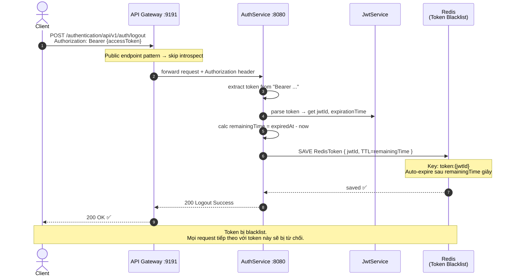
```mermaid
sequenceDiagram
    autonumber
    actor Client
    participant Gateway as API Gateway :9191
    participant Auth as AuthService :8080
    participant JWT as JwtService
    participant Redis as Redis<br/>(Token Blacklist)

    Client->>Gateway: POST /authentication/api/v1/auth/logout<br/>Authorization: Bearer {accessToken}
    Note over Gateway: Public endpoint pattern → skip introspect
    Gateway->>Auth: forward request + Authorization header

    Auth->>Auth: extract token from "Bearer ..."
    Auth->>JWT: parse token → get jwtId, expirationTime

    Auth->>Auth: calc remainingTime = expiredAt - now

    Auth->>Redis: SAVE RedisToken { jwtId, TTL=remainingTime }
    Note over Redis: Key: token:{jwtId}<br/>Auto-expire sau remainingTime giây

    Redis-->>Auth: saved ✅
    Auth-->>Gateway: 200 Logout Success
    Gateway-->>Client: 200 OK ✅

    Note over Client,Redis: Token bị blacklist.<br/>Mọi request tiếp theo với token này sẽ bị từ chối.
```

---

### 4. Introspect Flow

API Gateway gọi introspect để kiểm tra tính hợp lệ của token trước khi forward request.

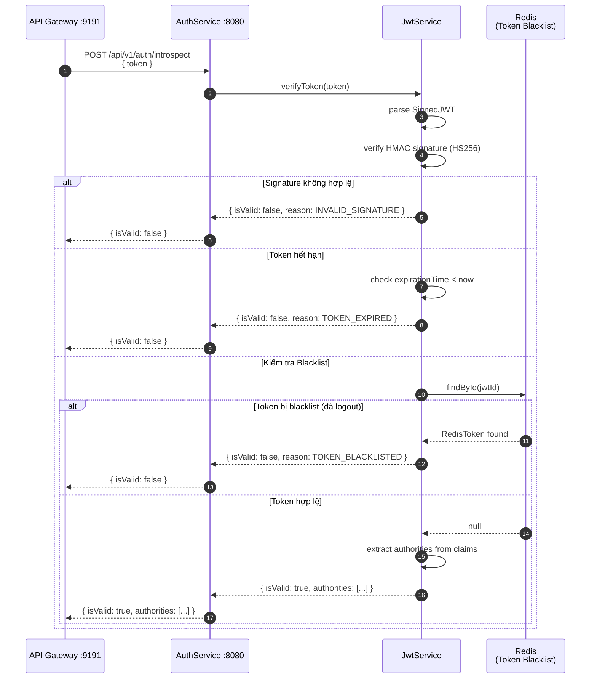
```mermaid
sequenceDiagram
    autonumber
    participant Gateway as API Gateway :9191
    participant Auth as AuthService :8080
    participant JWT as JwtService
    participant Redis as Redis<br/>(Token Blacklist)

    Gateway->>Auth: POST /api/v1/auth/introspect<br/>{ token }

    Auth->>JWT: verifyToken(token)

    JWT->>JWT: parse SignedJWT
    JWT->>JWT: verify HMAC signature (HS256)

    alt Signature không hợp lệ
        JWT-->>Auth: { isValid: false, reason: INVALID_SIGNATURE }
        Auth-->>Gateway: { isValid: false }
    else Token hết hạn
        JWT->>JWT: check expirationTime < now
        JWT-->>Auth: { isValid: false, reason: TOKEN_EXPIRED }
        Auth-->>Gateway: { isValid: false }
    else Kiểm tra Blacklist
        JWT->>Redis: findById(jwtId)
        alt Token bị blacklist (đã logout)
            Redis-->>JWT: RedisToken found
            JWT-->>Auth: { isValid: false, reason: TOKEN_BLACKLISTED }
            Auth-->>Gateway: { isValid: false }
        else Token hợp lệ
            Redis-->>JWT: null
            JWT->>JWT: extract authorities from claims
            JWT-->>Auth: { isValid: true, authorities: [...] }
            Auth-->>Gateway: { isValid: true, authorities: [...] }
        end
    end
```

---

### 5. Protected Request Flow

Toàn bộ request đến các service khác đều đi qua Gateway và được kiểm tra token tự động.

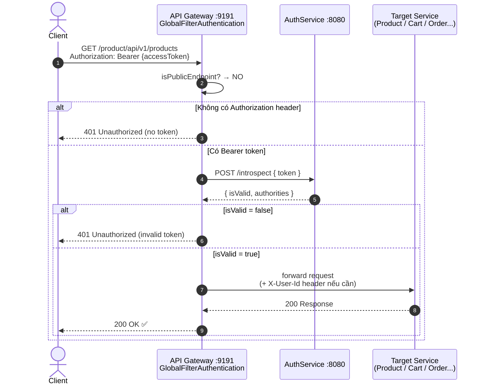
```mermaid
sequenceDiagram
    autonumber
    actor Client
    participant Gateway as API Gateway :9191<br/>GlobalFilterAuthentication
    participant Auth as AuthService :8080
    participant Service as Target Service<br/>(Product / Cart / Order...)

    Client->>Gateway: GET /product/api/v1/products<br/>Authorization: Bearer {accessToken}

    Gateway->>Gateway: isPublicEndpoint? → NO

    alt Không có Authorization header
        Gateway-->>Client: 401 Unauthorized (no token)
    else Có Bearer token
        Gateway->>Auth: POST /introspect { token }
        Auth-->>Gateway: { isValid, authorities }

        alt isValid = false
            Gateway-->>Client: 401 Unauthorized (invalid token)
        else isValid = true
            Gateway->>Service: forward request<br/>(+ X-User-Id header nếu cần)
            Service-->>Gateway: 200 Response
            Gateway-->>Client: 200 OK ✅
        end
    end
```

---

## 🔑 JWT Token Structure

### Access Token (TTL: 30 phút)

```json
{
  "alg": "HS256"
}
.
{
  "sub": "550e8400-e29b-41d4-a716-446655440000",
  "email": "user@example.com",
  "authorities": ["USER"],
  "token_type": "ACCESS_TOKEN",
  "jti": "unique-jwt-id",
  "iat": 1700000000,
  "exp": 1700001800
}
```

### Refresh Token (TTL: 60 phút)

```json
{
  "alg": "HS256"
}
.
{
  "sub": "550e8400-e29b-41d4-a716-446655440000",
  "token_type": "REFRESH_TOKEN",
  "jti": "unique-jwt-id",
  "iat": 1700000000,
  "exp": 1700003600
}
```

---

## 🚫 Token Blacklist Strategy

Khi user logout, token **không thể bị xóa** vì JWT là stateless. Giải pháp: lưu `jwtId` vào Redis với TTL bằng đúng thời gian còn lại của token.

```
LOGOUT Request
     │
     ▼
Parse token → lấy jwtId + expirationTime
     │
     ▼
remainingTTL = expirationTime - now (milliseconds)
     │
     ▼
Redis SET token:{jwtId}  TTL=remainingTTL
     │
     ▼
Redis tự động xóa key khi token hết hạn
→ Không tốn memory sau khi token expire
```

**Tại sao dùng Redis thay vì MySQL?**

| Tiêu chí | Redis | MySQL |
|----------|-------|-------|
| Tốc độ lookup | O(1) in-memory | Disk I/O |
| TTL tự động | ✅ Native | ❌ Cần scheduled job |
| Volume ghi | Cao (mỗi logout) | Tốn I/O |
| Phù hợp | ✅ Token blacklist | ❌ Không tối ưu |

---

## 🔗 Service Dependencies

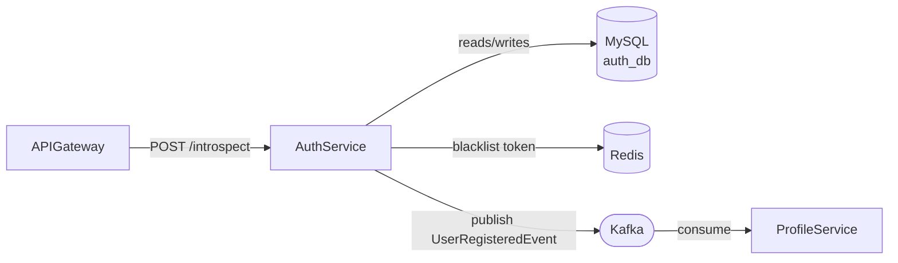
```mermaid
graph LR
    AuthService -->|"reads/writes"| MySQL[(MySQL\nauth_db)]
    AuthService -->|"blacklist token"| Redis[(Redis)]
    AuthService -->|"publish UserRegisteredEvent"| Kafka([Kafka])
    Kafka -->|"consume"| ProfileService
    APIGateway -->|"POST /introspect"| AuthService
```

---

*Generated for **ShopNow** portfolio project · Java 21 · Spring Boot 4.x*

# 📦 Product Service

> **ShopNow Microservices** · Spring Boot · Java 21 · Port `8081`

Quản lý toàn bộ danh mục sản phẩm: Product, Category (cây đa cấp), Variant (SKU/size/color). Tích hợp Redis caching và phát Kafka event khi có variant mới.

---

## 📡 API Endpoints

| Method | Path | Auth | Description |
|--------|------|------|-------------|
| `GET` | `/api/v1/products` | ❌ | Danh sách sản phẩm (filter + phân trang) |
| `GET` | `/api/v1/products/{id}` | ❌ | Chi tiết sản phẩm (cached) |
| `POST` | `/api/v1/products` | ADMIN | Tạo sản phẩm + upload files |
| `PATCH` | `/api/v1/products/{id}` | ADMIN | Cập nhật sản phẩm |
| `DELETE` | `/api/v1/products/{id}` | ADMIN | Soft delete (INACTIVE) |
| `POST` | `/api/v1/products/{id}/variants` | ADMIN | Thêm variant |
| `PATCH` | `/api/v1/products/{id}/variants/{vId}` | ADMIN | Cập nhật variant |
| `DELETE` | `/api/v1/products/{id}/variants/{vId}` | ADMIN | Soft delete variant |
| `GET` | `/api/v1/categories/tree` | ❌ | Cây category đa cấp |

---

## 📊 Workflow Diagrams

### Get Product (with Redis Cache)

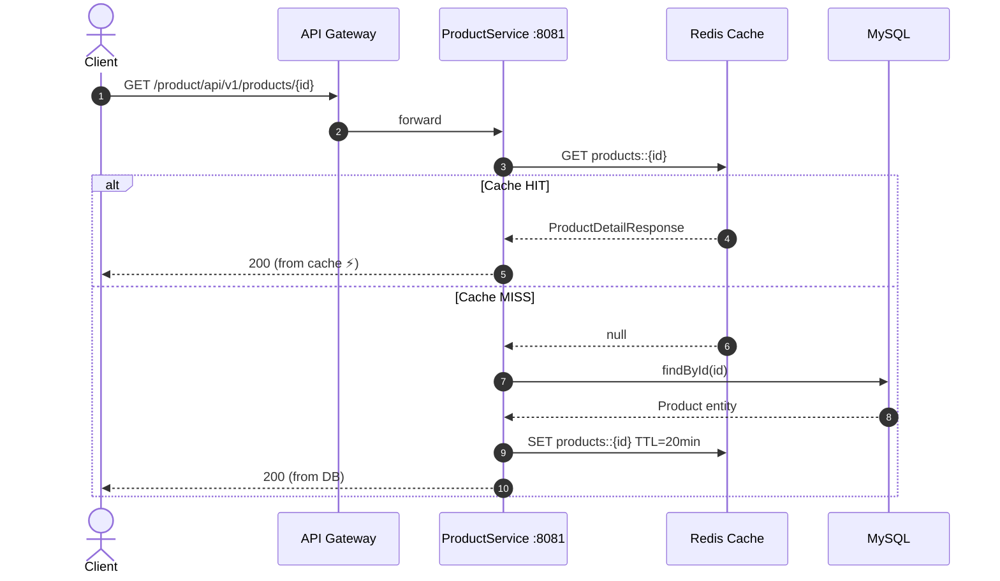
```mermaid
sequenceDiagram
    autonumber
    actor Client
    participant GW as API Gateway
    participant Product as ProductService :8081
    participant Redis as Redis Cache
    participant MySQL as MySQL

    Client->>GW: GET /product/api/v1/products/{id}
    GW->>Product: forward

    Product->>Redis: GET products::{id}
    alt Cache HIT
        Redis-->>Product: ProductDetailResponse
        Product-->>Client: 200 (from cache ⚡)
    else Cache MISS
        Redis-->>Product: null
        Product->>MySQL: findById(id)
        MySQL-->>Product: Product entity
        Product->>Redis: SET products::{id} TTL=20min
        Product-->>Client: 200 (from DB)
    end
```

### Create Product Flow

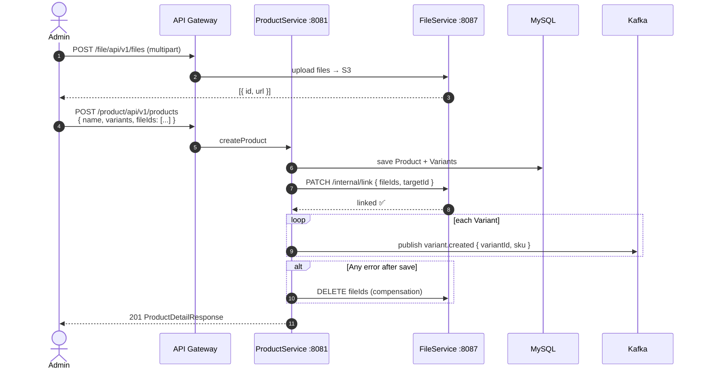
```mermaid
sequenceDiagram
    autonumber
    actor Admin
    participant GW as API Gateway
    participant Product as ProductService :8081
    participant File as FileService :8087
    participant MySQL as MySQL
    participant Kafka as Kafka

    Admin->>GW: POST /file/api/v1/files (multipart)
    GW->>File: upload files → S3
    File-->>Admin: [{ id, url }]

    Admin->>GW: POST /product/api/v1/products<br/>{ name, variants, fileIds: [...] }
    GW->>Product: createProduct

    Product->>MySQL: save Product + Variants
    Product->>File: PATCH /internal/link { fileIds, targetId }
    File-->>Product: linked ✅

    loop each Variant
        Product->>Kafka: publish variant.created { variantId, sku }
    end

    alt Any error after save
        Product->>File: DELETE fileIds (compensation)
    end

    Product-->>Admin: 201 ProductDetailResponse
```

---

## ⚡ Redis Cache Strategy

| Cache Name | Key | TTL | Invalidated on |
|------------|-----|-----|----------------|
| `products` | `products::{id}` | 20 min | update / delete product |
| `variants` | `variants::{variantId}` | 20 min | update / delete variant |

---

## 🗄 Database Schema

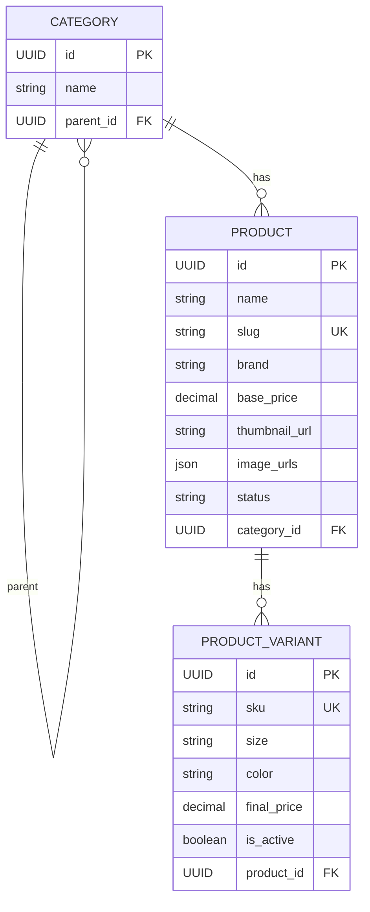
```mermaid
erDiagram
    PRODUCT {
        UUID id PK
        string name
        string slug UK
        string brand
        decimal base_price
        string thumbnail_url
        json image_urls
        string status
        UUID category_id FK
    }
    CATEGORY {
        UUID id PK
        string name
        UUID parent_id FK
    }
    PRODUCT_VARIANT {
        UUID id PK
        string sku UK
        string size
        string color
        decimal final_price
        boolean is_active
        UUID product_id FK
    }

    CATEGORY ||--o{ CATEGORY : "parent"
    CATEGORY ||--o{ PRODUCT : "has"
    PRODUCT ||--o{ PRODUCT_VARIANT : "has"
```

# 🏭 Inventory Service

> **ShopNow Microservices** · Spring Boot · Java 21 · Port `8082`

Quản lý tồn kho theo từng product variant. Hỗ trợ 4 loại transaction: **IMPORT**, **RESERVE**, **RELEASE**, **DEDUCT** với **Optimistic Lock + 3-retry** để xử lý concurrent requests.

---

## 📡 API Endpoints

### Public (Admin)
| Method | Path | Auth | Description |
|--------|------|------|-------------|
| `GET` | `/api/inventories` | ADMIN | Danh sách tồn kho + phân trang |
| `GET` | `/api/inventories/kpis` | ADMIN | Thống kê: inStock, lowStock, outOfStock |
| `POST` | `/api/inventories/{id}/import` | ADMIN | Nhập hàng (IMPORT) |

### Internal (Service-to-Service)
| Method | Path | Header | Description |
|--------|------|--------|-------------|
| `POST` | `/internal/inventories` | X-Internal-Key | Khởi tạo inventory cho variant mới |
| `POST` | `/internal/inventories/reserve` | X-Internal-Key | Reserve stock khi tạo order |
| `POST` | `/internal/inventories/release` | X-Internal-Key | Release stock khi hủy order |
| `POST` | `/internal/inventories/deduct` | X-Internal-Key | Deduct stock sau khi thanh toán |
| `GET` | `/internal/inventories/{variantId}` | X-Internal-Key | Kiểm tra tồn kho |

---

## 📊 Workflow Diagrams

### Stock Lifecycle

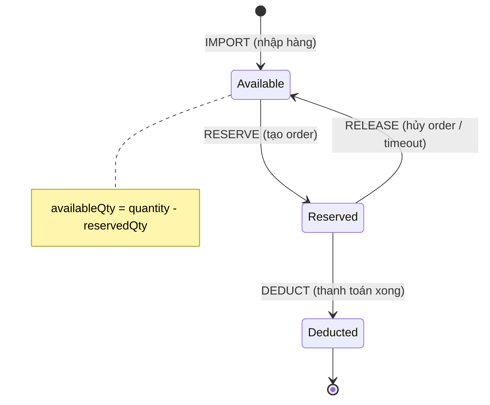
```mermaid
stateDiagram-v2
    [*] --> Available: IMPORT (nhập hàng)
    Available --> Reserved: RESERVE (tạo order)
    Reserved --> Available: RELEASE (hủy order / timeout)
    Reserved --> Deducted: DEDUCT (thanh toán xong)
    Deducted --> [*]

    note right of Available
        availableQty = quantity - reservedQty
    end note
```

### Reserve Stock with Optimistic Lock

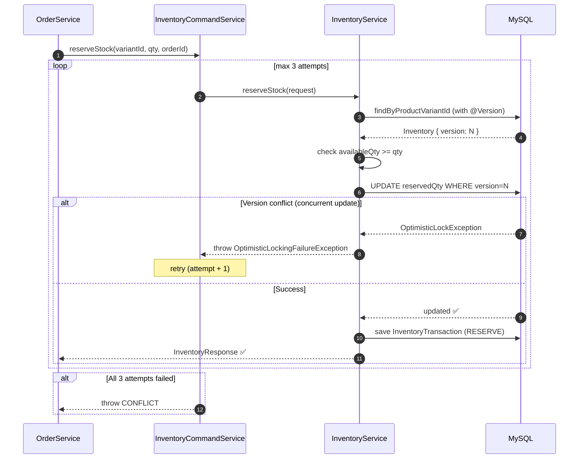
```mermaid
sequenceDiagram
    autonumber
    participant Order as OrderService
    participant Cmd as InventoryCommandService
    participant Svc as InventoryService
    participant MySQL as MySQL

    Order->>Cmd: reserveStock(variantId, qty, orderId)

    loop max 3 attempts
        Cmd->>Svc: reserveStock(request)
        Svc->>MySQL: findByProductVariantId (with @Version)
        MySQL-->>Svc: Inventory { version: N }

        Svc->>Svc: check availableQty >= qty
        Svc->>MySQL: UPDATE reservedQty WHERE version=N

        alt Version conflict (concurrent update)
            MySQL-->>Svc: OptimisticLockException
            Svc-->>Cmd: throw OptimisticLockingFailureException
            Note over Cmd: retry (attempt + 1)
        else Success
            MySQL-->>Svc: updated ✅
            Svc->>MySQL: save InventoryTransaction (RESERVE)
            Svc-->>Order: InventoryResponse ✅
        end
    end

    alt All 3 attempts failed
        Cmd-->>Order: throw CONFLICT
    end
```

### Cancel Order → Release Stock

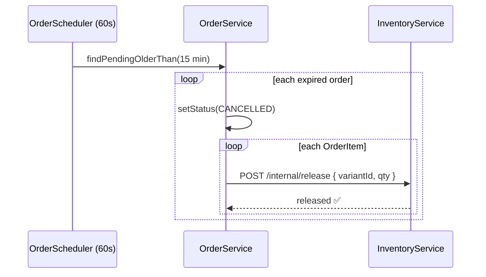
```mermaid
sequenceDiagram
    participant Scheduler as OrderScheduler (60s)
    participant Order as OrderService
    participant Inventory as InventoryService

    Scheduler->>Order: findPendingOlderThan(15 min)
    loop each expired order
        Order->>Order: setStatus(CANCELLED)
        loop each OrderItem
            Order->>Inventory: POST /internal/release { variantId, qty }
            Inventory-->>Order: released ✅
        end
    end
```

---

## 🗄 Database Schema

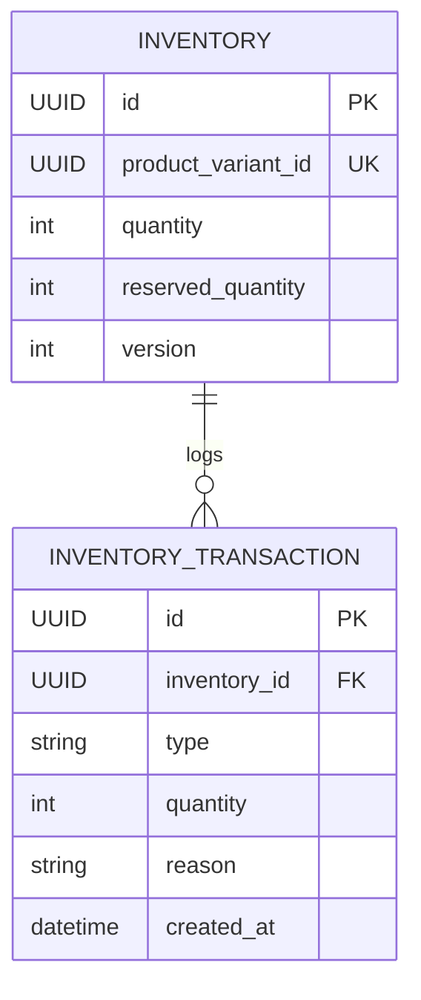
```mermaid
erDiagram
    INVENTORY {
        UUID id PK
        UUID product_variant_id UK
        int quantity
        int reserved_quantity
        int version
    }
    INVENTORY_TRANSACTION {
        UUID id PK
        UUID inventory_id FK
        string type
        int quantity
        string reason
        datetime created_at
    }
    INVENTORY ||--o{ INVENTORY_TRANSACTION : "logs"
```

> `availableQuantity = quantity - reservedQuantity` (computed, not stored)

# 🛒 Cart Service

> **ShopNow Microservices** · Spring Boot · Java 21 · Port `8083`

Quản lý giỏ hàng theo từng user. Dữ liệu được cache trên Redis (TTL 20 phút) để giảm tải DB. Tự động tạo cart nếu user chưa có.

---

## 📡 API Endpoints

| Method | Path | Auth | Description |
|--------|------|------|-------------|
| `GET` | `/api/v1/cart` | ✅ | Lấy giỏ hàng của user |
| `POST` | `/api/v1/cart/items` | ✅ | Thêm item vào giỏ |
| `PATCH` | `/api/v1/cart/items/{id}/quantity` | ✅ | Cập nhật số lượng |
| `DELETE` | `/api/v1/cart/items/{id}` | ✅ | Xóa item |
| `DELETE` | `/api/v1/cart` | ✅ | Xóa toàn bộ giỏ hàng |
| `GET` | `/internal/cart` | X-Internal-Key | Lấy cart (gọi bởi OrderService) |

---

## 📊 Workflow Diagrams

### Add Item to Cart

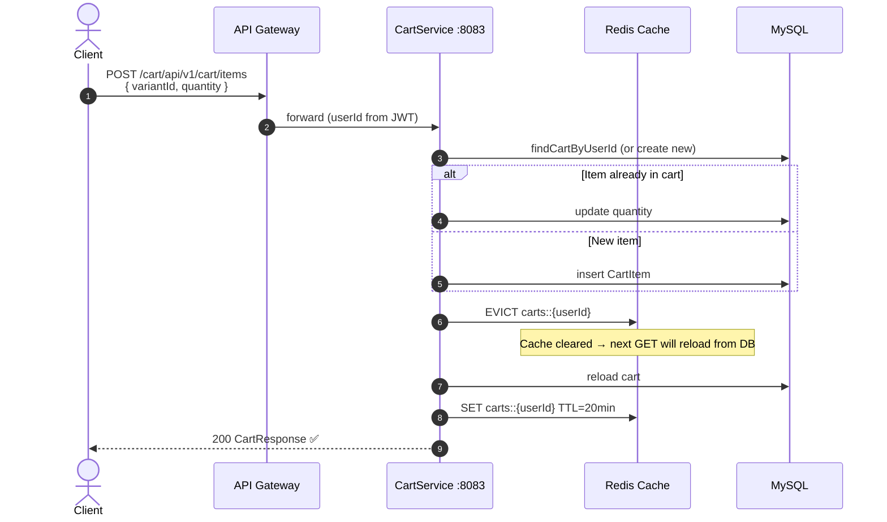
```mermaid
sequenceDiagram
    autonumber
    actor Client
    participant GW as API Gateway
    participant Cart as CartService :8083
    participant Redis as Redis Cache
    participant MySQL as MySQL

    Client->>GW: POST /cart/api/v1/cart/items<br/>{ variantId, quantity }
    GW->>Cart: forward (userId from JWT)

    Cart->>MySQL: findCartByUserId (or create new)

    alt Item already in cart
        Cart->>MySQL: update quantity
    else New item
        Cart->>MySQL: insert CartItem
    end

    Cart->>Redis: EVICT carts::{userId}
    Note over Redis: Cache cleared → next GET will reload from DB

    Cart->>MySQL: reload cart
    Cart->>Redis: SET carts::{userId} TTL=20min
    Cart-->>Client: 200 CartResponse ✅
```

### Get Cart (Cache Flow)

```mermaid
sequenceDiagram
    actor Client
    participant Cart as CartService :8083
    participant Redis as Redis
    participant MySQL as MySQL

    Client->>Cart: GET /api/v1/cart

    Cart->>Redis: GET carts::{userId}
    alt HIT
        Redis-->>Cart: CartResponse ⚡
        Cart-->>Client: 200 (cached)
    else MISS
        Cart->>MySQL: findByUserId + items
        MySQL-->>Cart: Cart entity
        Cart->>Redis: SET carts::{userId} TTL=20min
        Cart-->>Client: 200 (from DB)
    end
```

---

## ⚡ Redis Cache Strategy

| Cache | Key | TTL | Invalidated on |
|-------|-----|-----|----------------|
| `carts` | `carts::{userId}` | 20 min | add / update / remove item, clear cart |

---

## 🗄 Database Schema

```mermaid
erDiagram
    CART {
        UUID id PK
        UUID user_id UK
        datetime created_at
        datetime updated_at
    }
    CART_ITEM {
        UUID id PK
        UUID cart_id FK
        UUID product_variant_id
        int quantity
        decimal unit_price
    }
    CART ||--o{ CART_ITEM : "contains"
```

# 📋 Order Service

> **ShopNow Microservices** · Spring Boot · Java 21 · Port `8084`

Quản lý toàn bộ vòng đời đơn hàng từ tạo → thanh toán → giao hàng. Tích hợp đồng bộ với Cart, Inventory, Payment. Tự động hủy đơn PENDING quá 15 phút.

---

## 📡 API Endpoints

### User
| Method | Path | Auth | Description |
|--------|------|------|-------------|
| `POST` | `/api/v1/orders` | ✅ | Tạo đơn hàng từ giỏ hàng |
| `POST` | `/api/v1/orders/{id}/checkout` | ✅ | Checkout → nhận clientSecret Stripe |
| `GET` | `/api/v1/orders` | ✅ | Lịch sử đơn hàng (phân trang) |
| `GET` | `/api/v1/orders/{id}` | ✅ | Chi tiết đơn hàng |
| `POST` | `/api/v1/orders/{id}/cancel` | ✅ | Hủy đơn (không thể hủy khi SHIPPING/DELIVERED) |

### Internal
| Method | Path | Header | Description |
|--------|------|--------|-------------|
| `PATCH` | `/internal/{id}/status` | X-Internal-Key | Cập nhật trạng thái (gọi bởi PaymentService) |
| `GET` | `/internal/{id}` | X-Internal-Key | Lấy thông tin order |

---

## 📊 Workflow Diagrams

### Order Status Lifecycle

```mermaid
stateDiagram-v2
    [*] --> PENDING: createOrder
    PENDING --> CANCELLED: cancelOrder (user)<br/>or auto-cancel (15 min)
    PENDING --> PAID: checkout → Stripe webhook
    PAID --> CONFIRMED: PaymentService confirms
    CONFIRMED --> SHIPPING: Admin updates
    SHIPPING --> DELIVERED: Admin updates
    DELIVERED --> [*]
```

### Create Order Flow

```mermaid
sequenceDiagram
    autonumber
    actor User
    participant Order as OrderService :8084
    participant Cart as CartService :8083
    participant Inventory as InventoryService :8082
    participant MySQL as MySQL

    User->>Order: POST /api/v1/orders { shippingAddress }

    Order->>Order: check no active order (CONFIRMED/SHIPPING)
    Order->>Cart: GET /internal/cart (Bearer token)
    Cart-->>Order: CartResponse { items }

    Order->>MySQL: save Order (PENDING) + OrderItems
    Order->>Cart: DELETE /internal/cart (clear)

    loop each CartItem
        Order->>Inventory: POST /internal/reserve { variantId, qty }
        alt Reserve failed (out of stock)
            Inventory-->>Order: OUT_OF_STOCK
            Order->>Inventory: release all previously reserved items
            Order-->>User: 400 OUT_OF_STOCK
        else Reserve OK
            Inventory-->>Order: reserved ✅
        end
    end

    Order-->>User: 200 OrderResponse { orderId, status: PENDING }
```

### Checkout Flow

```mermaid
sequenceDiagram
    autonumber
    actor User
    participant Order as OrderService :8084
    participant Payment as PaymentService :8085
    participant Stripe as Stripe

    User->>Order: POST /api/v1/orders/{id}/checkout

    Order->>Order: check order.status == PENDING
    Order->>Payment: POST /internal/create-intent { orderId, amount }
    Payment->>Stripe: create PaymentIntent
    Stripe-->>Payment: { clientSecret }
    Payment-->>Order: { clientSecret }

    Order-->>User: 200 { clientSecret }

    Note over User,Stripe: User enters card info via Stripe.js
    User->>Stripe: confirmPayment(clientSecret)
    Stripe-->>Payment: POST /webhook (payment_intent.succeeded)
    Payment->>Order: PATCH /internal/{id}/status → CONFIRMED
```

### Auto-Cancel Expired Orders

```mermaid
sequenceDiagram
    participant Cron as Scheduler (every 60s)
    participant Order as OrderService
    participant Inventory as InventoryService

    Cron->>Order: find PENDING orders older than 15 min
    loop each expired order
        Order->>Order: setStatus(CANCELLED)
        loop each OrderItem
            Order->>Inventory: POST /internal/release
        end
    end
```

---

## 🗄 Database Schema

```mermaid
erDiagram
    ORDER {
        UUID id PK
        UUID user_id
        decimal total_amount
        string status
        json shipping_address
        string note
        datetime created_at
    }
    ORDER_ITEM {
        UUID id PK
        UUID order_id FK
        UUID product_variant_id
        int quantity
        decimal unit_price
    }
    ORDER ||--o{ ORDER_ITEM : "contains"
```

# 💳 Payment Service

> **ShopNow Microservices** · Spring Boot · Java 21 · Port `8085`

Tích hợp Stripe để xử lý thanh toán. Tạo PaymentIntent, lắng nghe webhook từ Stripe, cập nhật trạng thái đơn hàng và trừ tồn kho sau khi thanh toán thành công.

---

## 📡 API Endpoints

| Method | Path | Auth | Description |
|--------|------|------|-------------|
| `POST` | `/api/payment/create-intent` | ✅ | Tạo Stripe PaymentIntent |
| `POST` | `/api/payment/webhook` | ❌ (Stripe sig) | Nhận sự kiện từ Stripe |

---

## 📊 Workflow Diagrams

### Full Payment Flow

```mermaid
sequenceDiagram
    autonumber
    actor User
    participant Order as OrderService
    participant Payment as PaymentService :8085
    participant Stripe as Stripe
    participant Inventory as InventoryService

    Order->>Payment: POST /internal/create-intent<br/>{ orderId, amount, currency }
    Payment->>MySQL: save Payment { status: PENDING }
    Payment->>Stripe: createPaymentIntent(amount, currency)
    Stripe-->>Payment: { clientSecret, paymentIntentId }
    Payment-->>Order: { clientSecret }

    Note over User,Stripe: User xác nhận thanh toán qua Stripe.js
    User->>Stripe: confirmPayment(clientSecret)

    Stripe->>Payment: POST /api/payment/webhook<br/>event: payment_intent.succeeded
    Payment->>Payment: verify Stripe-Signature

    Note over Payment: Idempotency check
    Payment->>MySQL: findByPaymentIntentId
    alt Already COMPLETED (duplicate webhook)
        Payment-->>Stripe: 200 OK (skip)
    else First time
        Payment->>MySQL: setStatus(COMPLETED), paidAt=now
        Payment->>Order: PATCH /internal/{orderId}/status → CONFIRMED
        Payment->>Order: GET /internal/{orderId} (lấy items)
        loop each OrderItem
            Payment->>Inventory: POST /internal/deduct { variantId, qty }
        end
    end
```

### Idempotency Guard

```mermaid
flowchart TD
    A[Stripe Webhook Received] --> B[Verify Stripe-Signature]
    B -->|Invalid| C[Return 400]
    B -->|Valid| D[Parse PaymentIntent ID]
    D --> E[Find Payment by paymentIntentId]
    E -->|status = COMPLETED| F[Skip — already processed]
    E -->|status = PENDING| G[Set COMPLETED + paidAt]
    G --> H[Update Order → CONFIRMED]
    H --> I[Deduct Inventory per item]
    I --> J[Done ✅]
```

---

## 🗄 Database Schema

```mermaid
erDiagram
    PAYMENT {
        UUID id PK
        UUID order_id
        UUID user_id
        string payment_intent_id UK
        string client_secret
        long amount
        string currency
        string status
        datetime paid_at
        datetime created_at
    }
```

# 👤 Profile Service

> **ShopNow Microservices** · Spring Boot · Java 21 · Port `8086`

Quản lý thông tin cá nhân của user (firstName, lastName, username, avatar). Profile được tạo tự động khi user đăng ký thông qua Kafka event.

---

## 📡 API Endpoints

| Method | Path | Auth | Description |
|--------|------|------|-------------|
| `GET` | `/api/v1/profiles/me` | ✅ | Lấy profile của user hiện tại |
| `PATCH` | `/api/v1/profiles/me` | ✅ | Cập nhật profile |

---

## 📊 Workflow Diagrams

### Profile Creation via Kafka

```mermaid
sequenceDiagram
    autonumber
    participant Auth as AuthService :8080
    participant Kafka as Kafka<br/>(user.registered)
    participant Profile as ProfileService :8086
    participant MySQL as MySQL

    Note over Auth: User đăng ký thành công
    Auth->>Kafka: publish UserRegisteredEvent<br/>{ userId, email, name }

    Kafka-->>Profile: consume event (async)
    Profile->>MySQL: existsByUserId?
    alt Profile chưa tồn tại
        Profile->>MySQL: save Profile { userId, firstName, lastName }
    else Đã tồn tại (duplicate event)
        Profile-->>Profile: skip (idempotent)
    end
```

### Get My Profile

```mermaid
sequenceDiagram
    actor User
    participant GW as API Gateway
    participant Profile as ProfileService :8086
    participant MySQL as MySQL

    User->>GW: GET /profile/api/v1/profiles/me<br/>Authorization: Bearer {token}
    GW->>GW: introspect token → get userId
    GW->>Profile: forward request

    Profile->>Profile: extract userId from JWT (sub claim)
    Profile->>MySQL: findByUserId(userId)
    MySQL-->>Profile: Profile entity
    Profile-->>User: 200 ProfileResponse
```

---

## 🗄 Database Schema

```mermaid
erDiagram
    PROFILE {
        UUID id PK
        UUID user_id UK
        string first_name
        string last_name
        string username
        string avatar_url
        datetime created_at
        datetime updated_at
    }
```

> **Note:** Email được lưu ở **AuthService**, không lưu lại ở ProfileService — giữ đúng nguyên tắc data ownership của microservices.

# 📁 File Service

> **ShopNow Microservices** · Spring Boot · Java 21 · Port `8087`

Upload và quản lý file (ảnh/video) lên AWS S3. File được tạo ở trạng thái **TEMP** cho đến khi được link với một entity (Product...). Scheduled job dọn dẹp TEMP files mỗi ngày lúc 2:00 AM.

---

## 📡 API Endpoints

| Method | Path | Auth | Description |
|--------|------|------|-------------|
| `POST` | `/api/v1/files` | ✅ | Upload nhiều files lên S3 |
| `PATCH` | `/api/v1/files/link` | ✅ | Link files với entity (Product...) |
| `DELETE` | `/api/v1/files/{id}` | ✅ / ADMIN | Xóa file |

---

## 📊 Workflow Diagrams

### Upload & Link Flow

```mermaid
sequenceDiagram
    autonumber
    actor Admin
    participant File as FileService :8087
    participant S3 as AWS S3
    participant MySQL as MySQL
    participant Product as ProductService :8081

    Admin->>File: POST /api/v1/files (multipart/form-data)

    loop each file
        File->>File: validate (size, type)
        File->>File: generateS3Key (images/{UUID}.ext)
        File->>S3: putObject(key, bytes)
        S3-->>File: success
        File->>MySQL: save FileRecord { status: TEMP, targetId: null }
    end

    File-->>Admin: [{ id, url, status: TEMP }]

    Admin->>Product: POST /api/v1/products { fileIds: [...] }
    Product->>File: PATCH /api/v1/files/link<br/>{ fileIds, targetId, targetType: PRODUCT }
    File->>MySQL: UPDATE status=LINKED, targetId, targetType
    File-->>Product: linked ✅
```

### Cleanup Job (2:00 AM Daily)

```mermaid
flowchart TD
    A["@Scheduled — cron: 0 0 2 * * *"] --> B
    B["Find FileRecords WHERE status=TEMP\nAND created_at < now - 24h"] --> C{Any found?}
    C -->|No| D[Log: nothing to clean]
    C -->|Yes| E[Loop each file]
    E --> F[Delete from S3]
    F --> G[Delete from MySQL]
    G --> H[Log: cleaned N files]
```

### S3 Key Structure

```
S3 Bucket: shopnow-files
├── images/
│   ├── {UUID}.jpg
│   └── {UUID}.png
├── videos/
│   └── {UUID}.mp4
└── files/
    └── {UUID}.pdf
```

---

## 🗄 Database Schema

```mermaid
erDiagram
    FILE_RECORD {
        UUID id PK
        string name
        string url
        string thumbnail_url
        string content_type
        long size
        string media_type
        string status
        string target_type
        UUID target_id
        UUID uploaded_by
        datetime created_at
    }
```

> **status:** `TEMP` → file vừa upload, chưa gắn với entity nào | `LINKED` → đã gắn với Product/...

# 💬 Chat Service

> **ShopNow Microservices** · Spring Boot · Java 21 · Port `8088`

Real-time chat sử dụng WebSocket (STOMP protocol). Hỗ trợ chat 1-1, chat hỗ trợ khách hàng (USER → ADMIN tự động routing), online presence, typing indicator và last seen.

---

## 📡 API Endpoints

### HTTP REST
| Method | Path | Auth | Description |
|--------|------|------|-------------|
| `POST` | `/api/v1/conversations` | ✅ | Tạo cuộc trò chuyện |
| `POST` | `/api/v1/conversations/support` | ✅ | Tạo support conversation |
| `GET` | `/api/v1/conversations/my-conversation` | ✅ | Danh sách conversations |
| `GET` | `/api/v1/conversations/{id}/messages` | ✅ | Lịch sử tin nhắn (phân trang) |
| `POST` | `/api/v1/conversations/{id}/read` | ✅ | Đánh dấu đã đọc |
| `GET` | `/api/v1/users/{id}/online-status` | ✅ | Trạng thái online |

### WebSocket (STOMP)
| Destination | Direction | Description |
|-------------|-----------|-------------|
| `/app/chat.send` | Client → Server | Gửi tin nhắn |
| `/app/chat.typing` | Client → Server | Typing indicator |
| `/topic/conversations/{id}` | Server → Client | Nhận tin nhắn mới |
| `/topic/online-status` | Server → Client | Broadcast online/offline |
| `/user/queue/typing` | Server → Client | Typing notification (private) |
| `/user/queue/read-receipt` | Server → Client | Read receipt (private) |
| `/user/queue/assigned` | Server → Client | Conversation assigned (ADMIN) |

---

## 📊 Workflow Diagrams

### WebSocket Connection & Authentication

```mermaid
sequenceDiagram
    autonumber
    actor User
    participant GW as API Gateway
    participant Chat as ChatService :8088
    participant Redis as Redis
    participant MySQL as MySQL

    User->>GW: WS CONNECT /chat-service/ws<br/>?token={accessToken}
    Note over GW: WebSocket path → skip JWT introspect
    GW->>Chat: forward WS handshake

    Chat->>Chat: extract JWT from query param
    Chat->>Chat: verify JWT (local decode)
    Chat->>MySQL: save SocketSession { userId, sessionId, role }
    Chat->>Redis: DEL last_seen:{userId}

    Chat-->>User: CONNECTED ✅
    Chat->>Topic: broadcast /topic/online-status<br/>{ userId, online: true }

    Note over Chat: If user is ADMIN → auto pick up PENDING support conversations
```

### Send Message Flow

```mermaid
sequenceDiagram
    autonumber
    actor Sender
    participant Chat as ChatService
    participant MySQL as MySQL
    participant STOMP as STOMP Broker

    Sender->>Chat: /app/chat.send<br/>{ conversationId, content }

    Chat->>MySQL: verify sender is participant
    Chat->>MySQL: save Message { senderId, content, sentAt }
    Chat->>MySQL: update Conversation.lastMessageAt

    Chat->>STOMP: /topic/conversations/{conversationId}<br/>{ messageId, senderId, content, sentAt }

    Note over Sender: All participants in conversation receive message
```

### Support Chat Routing

```mermaid
sequenceDiagram
    autonumber
    actor Customer
    participant Chat as ChatService
    participant MySQL as MySQL
    participant Redis as Redis
    participant Admin as Admin (online)

    Customer->>Chat: POST /api/v1/conversations/support
    Chat->>MySQL: create Conversation { type: SUPPORT, status: PENDING }
    Chat->>MySQL: add Customer as participant

    Chat->>Redis: get online ADMIN sessions
    alt Admin available (< 5 active chats)
        Chat->>MySQL: add Admin as participant
        Chat->>MySQL: setStatus(ACTIVE)
        Chat->>Admin: /user/queue/assigned { conversationId }
        Chat-->>Customer: 200 { conversationId, status: ACTIVE }
    else No admin available
        Chat-->>Customer: 200 { conversationId, status: PENDING }
        Note over Chat: Admin will pick up when connecting
    end
```

### Online Presence & Last Seen

```mermaid
sequenceDiagram
    participant User
    participant Chat as ChatService
    participant Redis as Redis
    participant MySQL as MySQL

    Note over User: User disconnects (close browser / lost connection)

    Chat->>MySQL: find SocketSessions by userId
    Chat->>MySQL: delete this sessionId

    alt No more active sessions
        Chat->>Redis: SET last_seen:{userId} = now() TTL=30days
        Chat->>Topic: broadcast /topic/online-status<br/>{ userId, online: false, lastSeenAt }
    else User still has other sessions (multi-tab)
        Note over Chat: Do nothing — user still online
    end
```

---

## ⚡ Redis Usage

| Key Pattern | Value | TTL | Purpose |
|-------------|-------|-----|---------|
| `last_seen:{userId}` | ISO datetime string | 30 days | Last seen timestamp |
| `typing:{convId}:{userId}` | `"1"` | 3 seconds | Typing indicator (auto-expire) |

---

## 🗄 Database Schema

```mermaid
erDiagram
    CONVERSATION {
        UUID id PK
        string type
        string status
        datetime last_message_at
    }
    CONVERSATION_PARTICIPANT {
        UUID id PK
        UUID conversation_id FK
        UUID user_id
        datetime last_read_at
    }
    MESSAGE {
        UUID id PK
        UUID conversation_id FK
        UUID sender_id
        string content
        datetime sent_at
    }
    SOCKET_SESSION {
        string socket_session_id PK
        string user_id
        string username
        string role
        datetime connected_at
    }

    CONVERSATION ||--o{ CONVERSATION_PARTICIPANT : "has"
    CONVERSATION ||--o{ MESSAGE : "contains"
```
