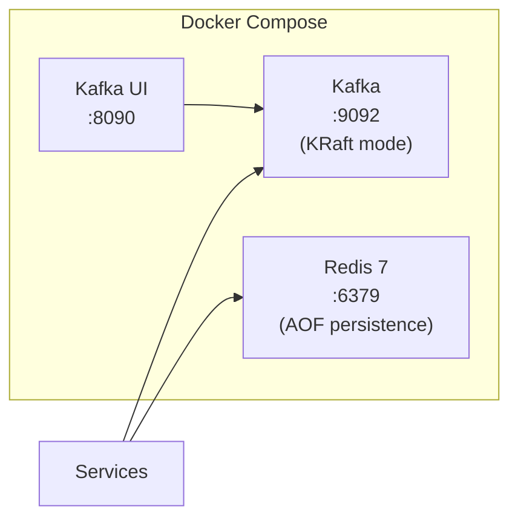
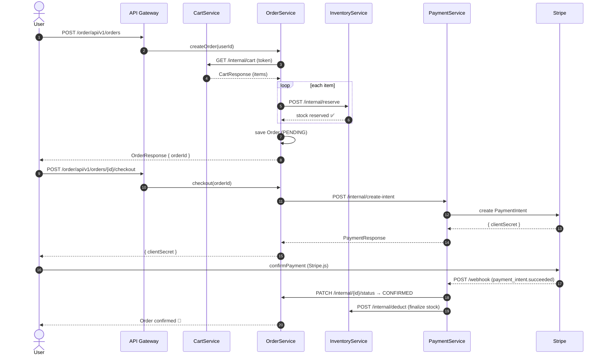
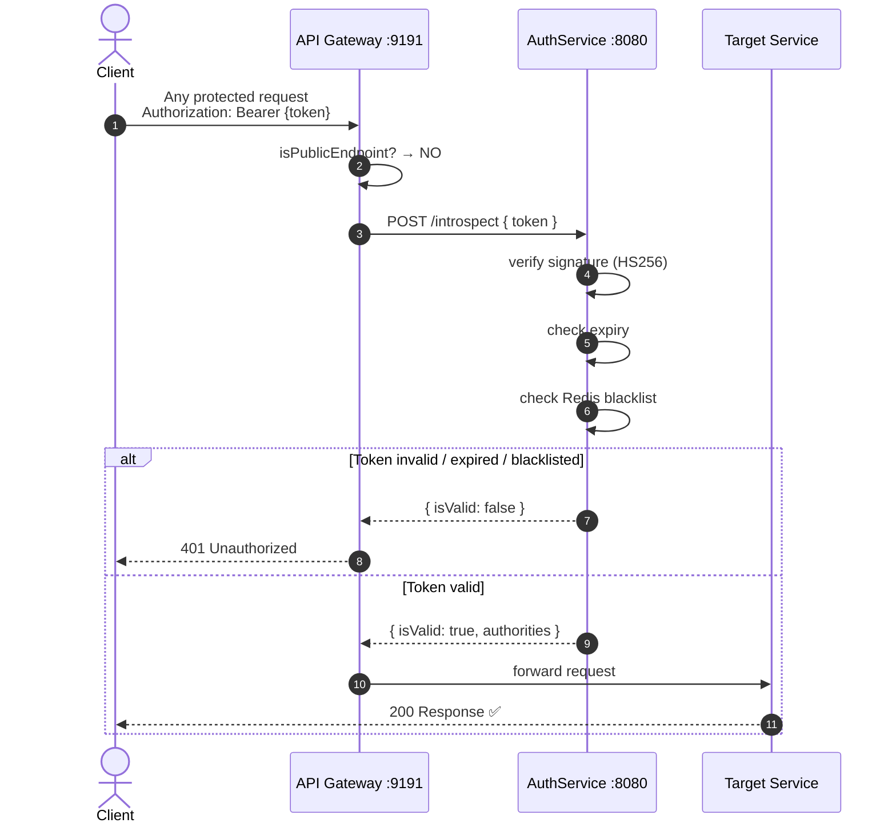
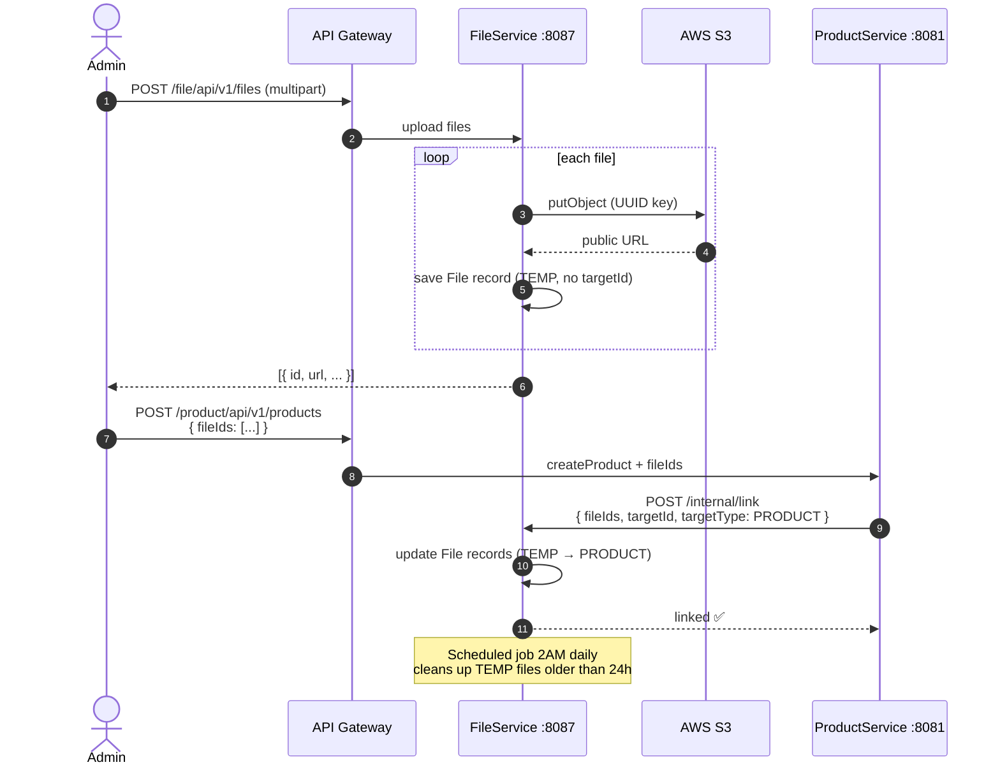

# 🛍️ ShopNow — Microservices eCommerce Platform

> A full-stack eCommerce system built with **Java 21 · Spring Boot 4.x · Next.js 14**,
> designed as a portfolio project demonstrating real-world microservices architecture.

---

## 📌 Table of Contents

- [Overview](#-overview)
- [Architecture](#-architecture)
- [Services](#-services)
- [Tech Stack](#-tech-stack)
- [Infrastructure](#-infrastructure)
- [Core Workflows](#-core-workflows)
  - [Purchase Flow](#1-purchase-flow-end-to-end)
  - [Authentication Flow](#2-authentication--gateway-flow)
  - [File Upload Flow](#3-file-upload-flow)
- [Project Structure](#-project-structure)
- [Getting Started](#-getting-started)

---

## 🧭 Overview

ShopNow is a microservices-based eCommerce platform that covers the full shopping lifecycle — from user registration and product browsing, to cart management, order placement, payment processing, and real-time customer support chat.

**Key design goals:**
- Each service owns its own database (no shared DB)
- All client requests route through a single API Gateway
- Synchronous HTTP for most inter-service calls; Kafka for async events
- Redis for caching and token blacklisting
- AWS S3 for file storage

---

## 🏛 Architecture


---

## 🗂 Services

| Service | Port | Responsibility |
|---------|------|----------------|
| **API Gateway** | `9191` | Single entry point, JWT validation, routing, CORS |
| **AuthService** | `8080` | Register, Login, Logout, JWT issue & introspect, token blacklist |
| **ProductService** | `8081` | Product catalog, categories, variants, Redis caching |
| **InventoryService** | `8082` | Stock tracking, reserve/release/deduct, optimistic lock |
| **CartService** | `8083` | Shopping cart CRUD, Redis cache (TTL 20 min) |
| **OrderService** | `8084` | Order lifecycle, checkout, auto-cancel stale orders |
| **PaymentService** | `8085` | Stripe PaymentIntent, webhook handling, idempotency |
| **ProfileService** | `8086` | User profile, consumes `user.registered` Kafka event |
| **FileService** | `8087` | Multi-file upload to AWS S3, temp file cleanup (2 AM daily) |
| **ChatService** | `8088` | Real-time chat (STOMP/WebSocket), support routing, online presence |

---

## 🛠 Tech Stack

### Backend
| Category | Technology |
|----------|-----------|
| Language | Java 21 |
| Framework | Spring Boot 4.x |
| Security | Spring Security, JWT (Nimbus JOSE) |
| ORM | Spring Data JPA / Hibernate |
| Messaging | Apache Kafka (KRaft — no Zookeeper) |
| Cache | Redis 7 (AOF persistence) |
| Real-time | Spring WebSocket + STOMP |
| HTTP Client | Spring 6 HTTP Interface |
| API Docs | Swagger UI (per service) |
| Payments | Stripe SDK |
| Storage | AWS S3 |

### Frontend
| Category | Technology |
|----------|-----------|
| Framework | Next.js 14 (App Router) |
| Language | TypeScript |
| State | Zustand |
| HTTP | Axios |
| WebSocket | STOMP.js |
| Payments | Stripe Elements |

### Infrastructure
| Component | Technology |
|-----------|-----------|
| Container | Docker Compose |
| Network | `shopnow-network` (bridge) |
| Database | MySQL 8 (one DB per service) |
| Cache | Redis 7 Alpine |
| Messaging | Confluent Kafka (KRaft) |
| Kafka UI | Provectus Kafka UI `:8090` |

---

## ⚙️ Infrastructure



**Redis** serves multiple roles across services:

| Service | Redis Usage |
|---------|------------|
| AuthService | Token blacklist (jwtId → TTL auto-expire) |
| CartService | Cart cache (TTL 20 min, `@Cacheable`) |
| ChatService | Online presence (`last_seen:{userId}`), typing indicator, socket sessions |

---

## 🔄 Core Workflows

### 1. Purchase Flow (End-to-End)



---

### 2. Authentication & Gateway Flow



---

### 3. File Upload Flow



---

## 📁 Project Structure

```
ShopNow/
├── backend/
│   ├── ApiGatewayService/      # :9191 — routing + JWT filter
│   ├── AuthenticationService/  # :8080 — auth, JWT, Redis blacklist
│   ├── productService/         # :8081 — catalog, categories
│   ├── InventoryService/       # :8082 — stock, reserve/deduct
│   ├── CartService/            # :8083 — cart + Redis cache
│   ├── OrderService/           # :8084 — order lifecycle
│   ├── PaymentService/         # :8085 — Stripe integration
│   ├── ProfileService/         # :8086 — user profile
│   ├── FileService/            # :8087 — S3 upload
│   ├── ChatService/            # :8088 — WebSocket chat
│   └── docker-compose.yml      # Kafka + Redis
│
└── frontend/
    └── shopnow-frontend/       # Next.js 14
        ├── src/
        │   ├── app/            # App Router pages
        │   ├── services/       # Axios API clients
        │   ├── stores/         # Zustand state
        │   └── types/          # TypeScript types
        └── .env.local          # API URLs → all via :9191
```

---

## 🚀 Getting Started

### Prerequisites

- Java 21
- Node.js 18+
- Docker & Docker Compose
- AWS Account (S3)
- Stripe Account

### 1. Start Infrastructure

```bash
cd backend
docker compose up -d
```

Starts: **Kafka** `:9092`, **Kafka UI** `:8090`, **Redis** `:6379`

### 2. Start Backend Services

Start each service in order (Auth → Product → Inventory → Cart → Order → Payment → Profile → File → Chat → Gateway):

```bash
# Example — run from each service directory
./mvnw spring-boot:run
```

Or open in IntelliJ and run all services via the Spring Boot run configurations.

### 3. Start Frontend

```bash
cd frontend/shopnow-frontend
npm install
npm run dev
```

App available at `http://localhost:3000`

### 4. Environment Variables

Each backend service has its own `application.yml`. Key configs:

```yaml
# Common pattern
jwt:
  secret-key: <base64-encoded-secret>

internal:
  api-key: <shared-internal-key>

spring:
  datasource:
    url: jdbc:mysql://localhost:3306/ecommerce_<service>
  kafka:
    bootstrap-servers: localhost:9092
  data:
    redis:
      host: localhost
      port: 6379
```

Frontend `.env.local`:
```env
NEXT_PUBLIC_AUTH_SERVICE_URL=http://localhost:9191/authentication
NEXT_PUBLIC_PRODUCT_SERVICE_URL=http://localhost:9191/product
NEXT_PUBLIC_CART_SERVICE_URL=http://localhost:9191/cart
NEXT_PUBLIC_ORDER_SERVICE_URL=http://localhost:9191/order
NEXT_PUBLIC_PAYMENT_SERVICE_URL=http://localhost:9191/payment
NEXT_PUBLIC_PROFILE_SERVICE_URL=http://localhost:9191/profile
NEXT_PUBLIC_FILE_SERVICE_URL=http://localhost:9191/file
NEXT_PUBLIC_CHAT_SERVICE_URL=http://localhost:9191/chat-service
NEXT_PUBLIC_STRIPE_PUBLISHABLE_KEY=pk_test_...
```

---

## 🔐 Security Design

```
Public endpoints (no JWT required):
  POST /authentication/api/v1/auth/login
  POST /authentication/api/v1/users/register
  POST /payment/api/payment/webhook      ← Stripe webhook
  WS   /chat-service/ws/**

Protected endpoints:
  All others → API Gateway validates JWT via introspect

Internal endpoints (service-to-service):
  /*/internal/** → blocked at Gateway for external callers
                 → requires X-Internal-Key header
```

---

*Built by a Junior Java Developer as a portfolio project · Java 21 · Spring Boot 4.x · Next.js 14*
